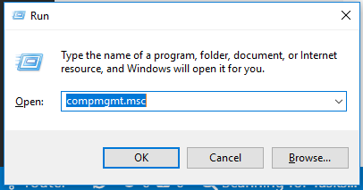
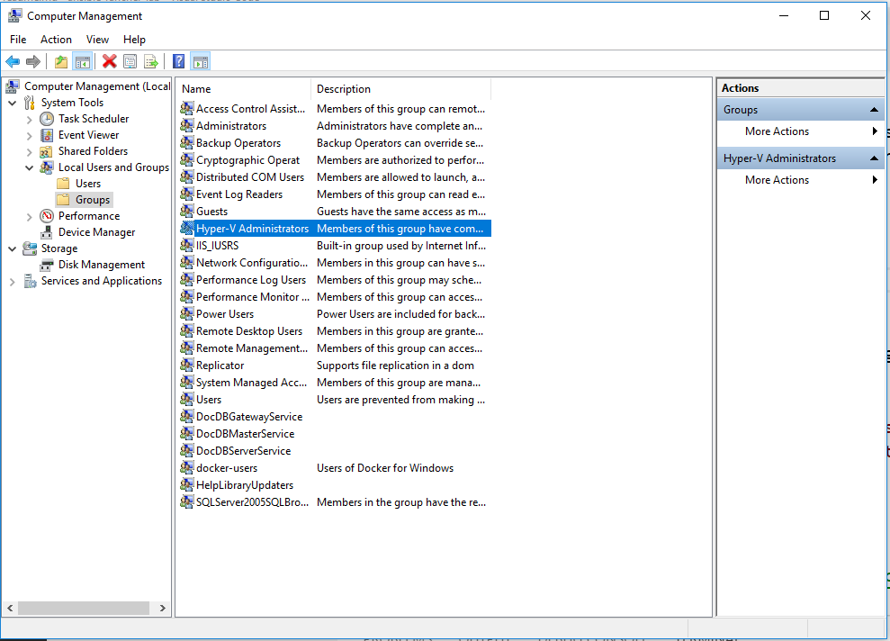

# Ansible Lab

## Enabling user-mode execution of Vagrant with Hyper-V

### Open `compmgmt.msc`

### Navigate to the Hyper-V Administrators Group

1. Navigate to: `Local Users and Groups`
2. Navigate to: `Groups`
3. Double-click the `Hyper-V Administrators` group.

### Add your user to the Hyper-V Administrators Group

1. Click Add.
2. Type your username in the Select Users Dialog.
3. Click OK on the Select Users dialog.
4. Click OK on the Hyper-V Administrators Dialog.
5. Close `compmgmt.msc`.

[Back to readme.md](../readme.md)