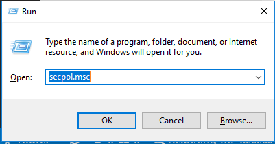
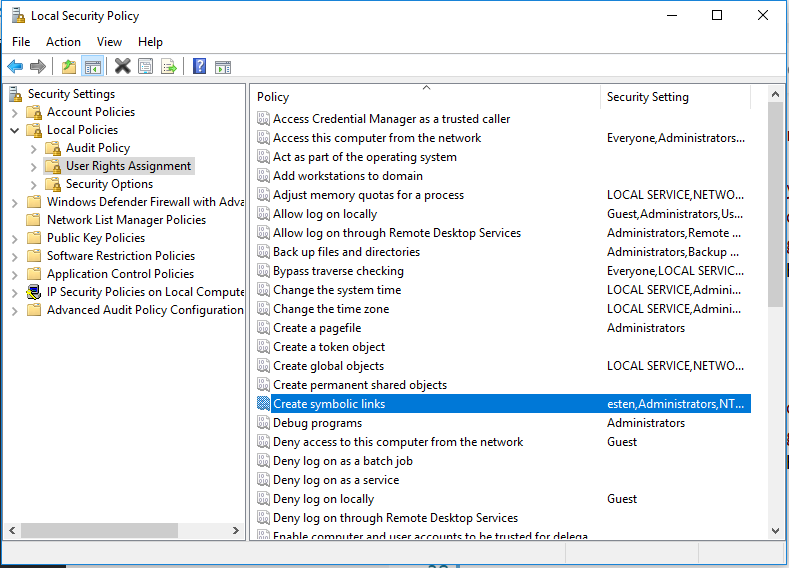
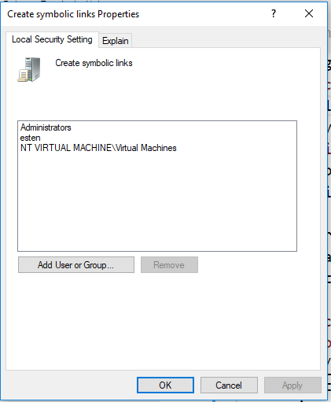
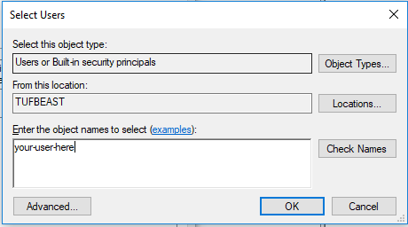

# Ansible Lab

## Enabling Creation of Symbolic Links with `gpedit.msc`

### Open `secpol.msc`

### Navigate to the Create symbolic links policy

1. Navigate to: `Local Policies`
2. Navigate to: `User Rights Assignment`
3. Navigate to: `Create symbolic links`
4. Double-click: `Create symbolic links`

### Add your user to the policy

1. Click: `Add User or Group`
2. Type your username in the Select Users Dialog.
3. Click `OK` on the Select Users dialog.
4. Click `OK` on the Create symbolic links Dialog.
5. Close `secpol.msc`

### Log out and log back in to apply the policy changes.

[Back to readme.md](../readme.md)