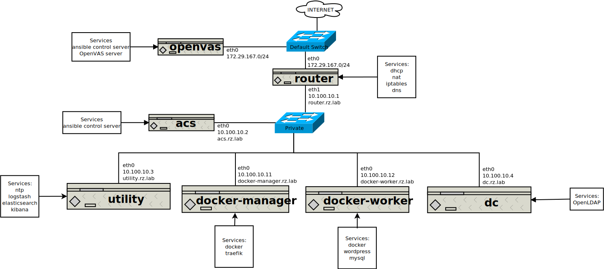

# Ansible Lab

## Network Diagram



## Host Machine Setup

1. Enable Hyper-V
2. Install Vagrant
3. Install Git

  - Ensure the following options are selected:
    - Use OpenSSH
    - Use the native Windows Secure Channel Library
    - Checkout as-is, commit Unix-style line endings
    - Use MinTTY
    - Enable file system caching
    - Enable Git Credential Manager
    - Enable symbolic links
    - Enable experimental, built-in rebase
    - Enable experimental, built-in stash

4. Enable Developer Mode for Windows 10.
5. Set Group Policy to allow your user to create symbolic links without an elevated shell using one of the following options.

  - Option A: [Update policy using gpedit.msc](.docs/gpedit-symbolic-links.md)
  - Option B: [Update policy using secpol.msc](.docs/secpol-symbolic-links.md)

6. [Add your user to the list of Hyper-V Administrators.](.docs/hyperv-administrators-group.md)  This will allow you to use vagrant without opening an Administrative PowerShell prompt.

7. Clone repo using `git clone -c core.symlinks=true git@github.com:estenrye/ansible-rancher-lab.git`
8. Add the bin directory installed with git to your path:

```powershell
# From http://www.hurryupandwait.io/blog/need-an-ssh-client-on-windows-dont-use-putty-or-cygwinuse-git
if (-not $env:PATH.Contains('C:/Program Files/Git/usr/bin'))
{
    $new_path = "$env:PATH;C:/Program Files/Git/usr/bin"
    $env:PATH=$new_path
    [Environment]::SetEnvironmentVariable("path", $new_path, "user")
}
```

## Launching the Ansible Control Server and Lab Router

The vagrant driver for Hyper-V lacks two components that allow us to have a predictable lab setup.  The first is that the Hyper-V vagrant driver does not provide a mechanism for specifying multiple Network Interface Adapters on a guest VM.  The second is that the Hyper-V vagrant driver does not provide a mechnanism for specifying a static IP address for a guest VM on any network type.  This project addresses the first problem by using a combination of vagrant commands and PowerShell commandlets to add a second Network Interface Adapter to the router guest VM.  It addresses the second by dynamically generating the inventory on the host machine and copying it to the acs guest VM.

1. Run `.\scripts\Launch.ps1`
2. Run `vagrant ssh openvas`
3. `cd ansible-rancher-lab`
4. `ansible-playbook -i inventory --become network.yml`
5. Exit out of the openvas VM.
6. Run `vagrant up acs utilityServer`
7. Run `vagrant ssh acs`
8. `cd ansible-rancher-lab`
9. `ansible-playbook -i rz_lab_inventory --become net-plan.internal.yml`
10. `ansible-playbook -i rz_lab_inventory --become site.yml`

## References

Much of this project wouldn't be, if not for the great contributions of others.  Please check out their sites in the [references](.docs/references.md).