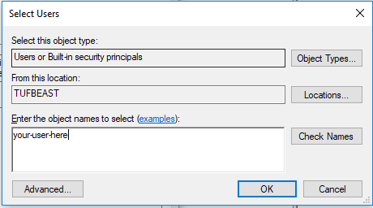
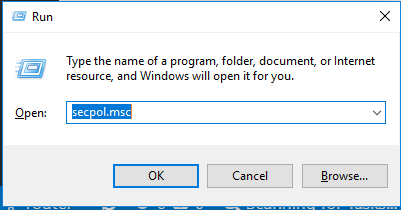

# Ansible Lab

## Host Machine Setup

1. Enable Hyper-V
2. Install Vagrant
3. Install Git

  - Ensure the following options are selected:
    - Use OpenSSH
    - Use the native Windows Secure Channel Library
    - Checkout as-is, commit Unix-style line endings
    - Use MinTTY
    - Enable file system caching
    - Enable Git Credential Manager
    - Enable symbolic links
    - Enable experimental, built-in rebase
    - Enable experimental, built-in stash

4. Enable Developer Mode for Windows 10.
5. Set Group Policy to allow your user to create symbolic links without an elevated shell using one of the following options.

  - Option A: 
    - Open `gpedit.msc`

      

    - Navigate to: `Computer Configuration`
    - Navigate to: `Windows Settings`
    - Navigate to: `Security Settings`
    - Navigate to: `Local Policies`
    - Navigate to: `User Rights Assignment`
    - Navigate to: `Create symbolic links`

      
      
    - Double-click: `Create symbolic links`

      
    
    - Click: `Add User or Group`
    
    - Type your username in the Select Users Dialog.
    - Click `OK` on the Select Users dialog.
    - Click `OK` on the Create symbolic links Dialog.
    - Close `gpedit.msc`
    - Log out.
    - Log in.
  - Option B: 
    - Open `secpol.msc`
      
    - Navigate to: `Local Policies`
    - Navigate to: `User Rights Assignment`
    - Navigate to: `Create symbolic links`
      
    - Double-click: `Create symbolic links`
      
    - Click: `Add User or Group`
    
    - Type your username in the Select Users Dialog.
    - Click `OK` on the Select Users dialog.
    - Click `OK` on the Create symbolic links Dialog.
    - Close `secpol.msc`
    - Log out.
    - Log in.

6. Add your user to the list of Hyper-V Administrators.  This will allow you to use vagrant without opening an Administrative PowerShell prompt.

  - Open `compmgmt.msc`
    
  - Navigate to: `Local Users and Groups`
  - Navigate to: `Groups`
    
  - Double-click the `Hyper-V Administrators` group.
    
  - Click Add.
    
  - Type your username in the Select Users Dialog.
  - Click OK on the Select Users dialog.
  - Click OK on the Hyper-V Administrators Dialog.
  - Close `compmgmt.msc`.


7. Clone repo using `git clone -c core.symlinks=true git@github.com:estenrye/ansible-rancher-lab.git`
8. Add the bin directory installed with git to your path:

```powershell
# From http://www.hurryupandwait.io/blog/need-an-ssh-client-on-windows-dont-use-putty-or-cygwinuse-git
if (-not $env:PATH.Contains('C:/Program Files/Git/usr/bin'))
{
    $new_path = "$env:PATH;C:/Program Files/Git/usr/bin"
    $env:PATH=$new_path
    [Environment]::SetEnvironmentVariable("path", $new_path, "user")
}
```